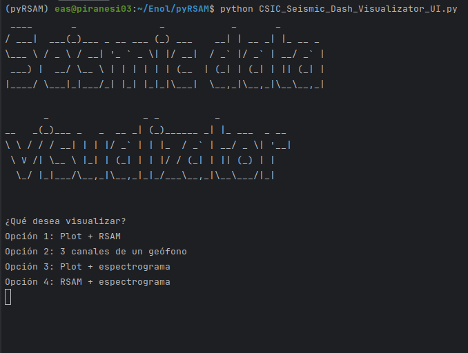
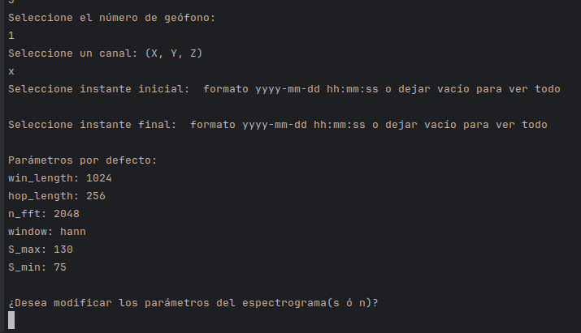
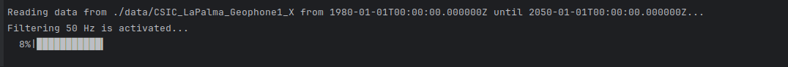
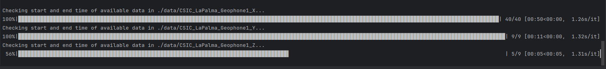
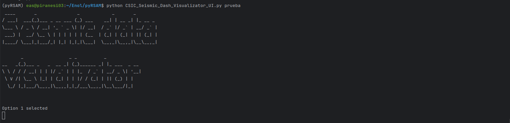
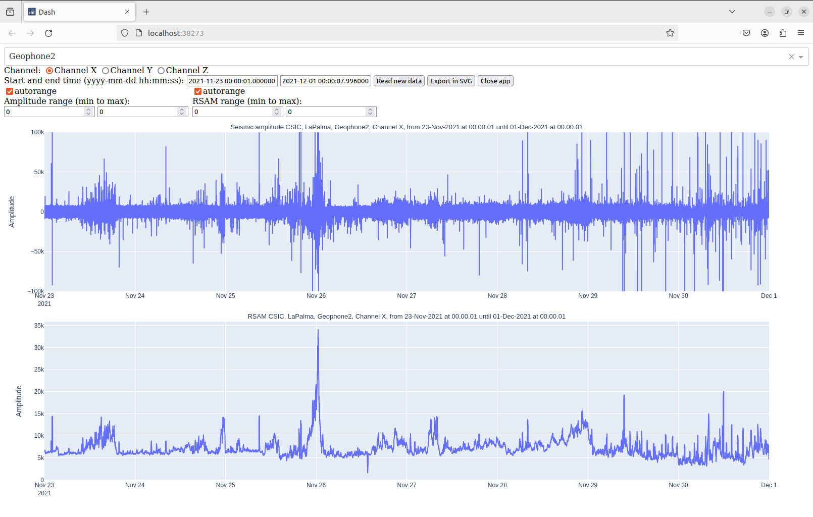
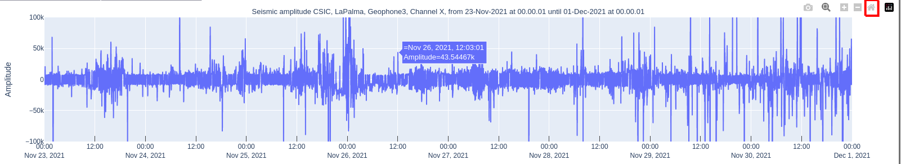
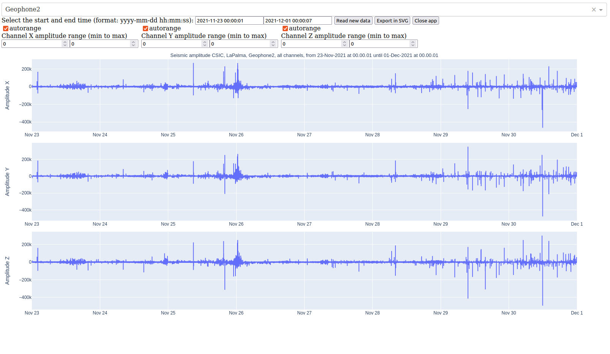
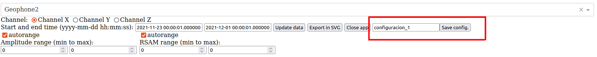
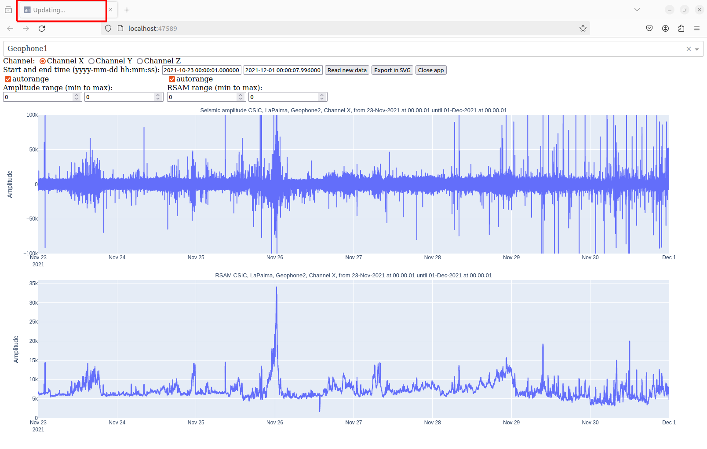

# Installation
The Python version must be python 3.11.
Install the following elements by writting this in the terminal:
- pip install obspy==1.4.0
- pip install librosa==0.10.1
- pip install dash==2.7.0
- pip install pandas==2.1.4
- pip install pyautogui==0.9.54
- pip install tqdm==4.65.0
- pip install pyfiglet==1.0.2
- pip install screeninfo==0.8.1
- pip install pyyaml==6.0.1
- pip install bz2file==0.98
- pip install cairosvg==2.7.1
- pip install psutil==5.9.8

# Data preparation and preprocessing
Data from geophones should be in the project folder `.\data\LaPalma`
Execute from the terminal: 
`data_preprocessing01.bat` 

Or alternatively: `python data_preprocessing.py configurations/preprocessingLaPalma.yaml`.

The parameters used in the script `data_preprocessing.py` are specified in the text-like configuration file 
`configurations/preprocessingLaPalma.yaml`. This file contains the following parameters:
- Paths for the input acquired data from the geophones (`path_data`) and for the output preprocessed data
(`path_output`).
```
# Data path
paths:
  path_data: ./data/LaPalma/  # Path to input datafiles
  path_output: ./results    # Path for output data (results)
```
- Data information about the seismic `network` and `station` of the acquired data.
```
# Data information
data_info:
  network: CSIC
  station: LaPalma
```
- xxx
```
# Sensor correction
sensor_correction:
  correc_f: True  # Correction flag
  # Sensor correction parameters: coefficients of the numerator and denominator of the transfer function
  b: [1.0000, -1.5365, 0.6507]   # Numerator
  a: [-1.0000, 1.9388, -0.9388]  # Denominator
```
- xxx
```
# Demean data trend
filter:
  demean_f: True
```
- xxx
```
# Time interval of data
time_interval: 86400  # Length in seconds. Example: 86400 seconds is one day.
```
- xxx
```
# Verbosing
verbose: True
```
- xxx
```
# Data format
data_format:
  format_in: SEG2        # Format of input datafiles
  format_out: PICKLE  # Format of output datafiles
```
# Data visualization user interface
Execute from the terminal:`python CSIC_Seismic_Dash_Visualizator_UI.py`. Then the following prompt will appear:



You have to write the number corresponding to the option that you want to visualize and then press Enter.
Then you have to select the number of the geophone (1 to 8), the channel (X, Y, Z) for options 1, 3 and 4, and the earliest and latest time that you want to visualize data from. If you want to visualize all the available data, just press Enter without typing anything when the program asks you for start and end time.


If the option 3 or 4 are selected (Amplitude/RSAM  + Spectrogram), the progream will show some spectrogram-related parameters and its default value and ask you if you wish to modify them. Type 's' and press Enter if you want to modify thoose parameters, or type 'n' to use the default values.





Then, if options 1, 3 or 4 are selected, the program starts to read the data. When it is ready, the browser will automatically be launched.





If option 2 is selected, the program will first check the start and end time of the available data for each channel. If they are different, the program will select the dates interval for which all channels have available data. Then, data will be readed.





Alternatively, you can pass as a parameter of the program a saved configuration: python CSIC_Seismic_Dash_Visualizator_UI.py config_name.
The parameter is the name of the file of the configuration saved in `./user_config`.



# Options 1, 3 and 4

The operation of theese 3 options is similar:




First, we have a geoophone selector, channel selector and start and end dates selector. Theese selectors are used to read new data. If the user wishes to do so, after selecting the parameters, the button 'Update data' must be pressed.

There is also a button 'Export in SVG'. After pressing it, all the figures on the screen will be exported to the folder (`exports/`) on the project directory.

Then there is the 'Close app' button. It is recommended to pressed it for ending the session. If the user just closses the browser, the program will still be running, so in order to close it Ctrl + C must be typed on the Pycharm terminal.

Finally, we find the amplitude selectors for both plots. If the 'autorange' option is marked, the maximum aplitude value displayed in the amplitude plot will be 100,000. (This does not apply for RSAM). The user may disable this option and select manually the desired amplitude range for both figures.

Visualization options 3 and 4 have some additional selectors related to the spectrogram:


The frequency range selectors is meant to select the displayed frequencies, which by default starts as 5 Hz, as the geophones are not able to capture information for lower frequencies. The Spectrogream power range selector modifies the color legend range of the spectrogram. However, we can check the actual value of one point by placing the mouse over it.


Additionally, it must be said that for options 1, 3 and 4 there is the possibility of zooming manually over the figure. After zooming, the program will compute a more precise representation for the selected area, and all figures will be synchronized. This may take a time, primaraly if there is a spectrogram involved. If the user wants to bring back the original representation, the 'Reset axis' button, present on every figure, must be pressed.




# Option 2.

If the user selects this option, the program will display the 3 channels of a single geophone:



The operation of this program is the same that for the others but for one difference. As we have information of 3 channels, there is a lot of information to be stored. Therefore, after zooming on one figure, the program will not recompute automatically the plot for that area. The zoom of the 3 figures will still be synchronized, but after each zoom resolution will be lost. The user may press the 'Update data' button after the zoom to get a more precise representation. However, this will take a considerable amount of time, as the information from the geophones must be readed again.


# Saving a configuration

The program has the possibility of saving a configuration that can be reloaded later without having to modify all the salectors. You just have to write a config_name and press the 'Save config' button. For loading the configuration just write python CSIC_Seismic_Dash_Visualizator_UI.py and then the configuration name.




#  Some considerations

It is recommended not to touch any input of the program when in the tab name appears 'Updating...', unless you press the 'Close app' button. Wait until it disappears before changing any parameter, specially after pressing the button 'Update data'. The reading of new data may be interrupted and the representation lost, so it would be necessary to refresh the page and read again.

